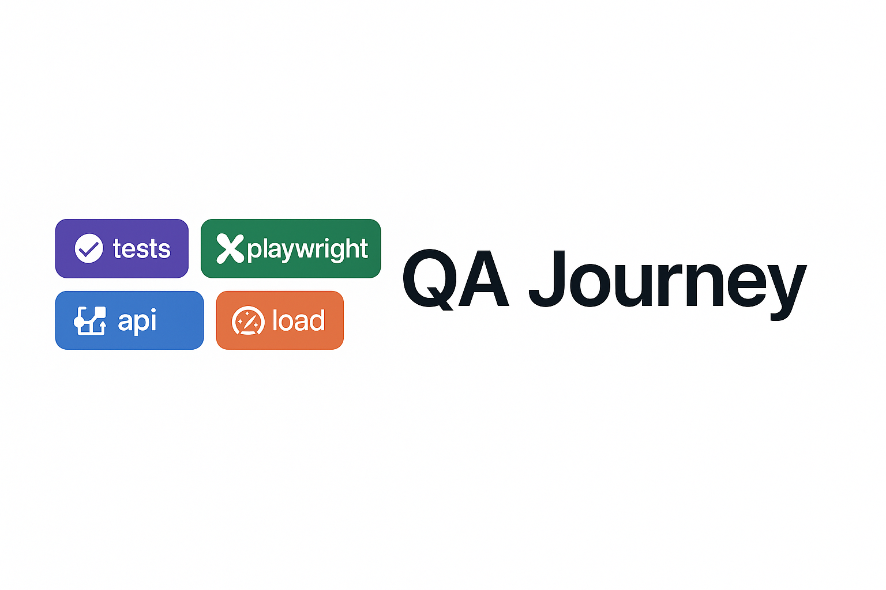

# 🧪 QA-Journey – End-to-End QA Testing Portfolio

This repository showcases a full professional QA testing journey — from manual test case design to modern automated testing using Playwright, API testing with Postman, load testing with k6, and visual regression testing tools like Percy.

---

## 📁 Project Structure

| Folder | Description |
|--------|-------------|
| `ManualTesting/` | Excel sheets with manual test cases, bug reports, and test plans |
| `PlaywrightAutomation/` | Automated web UI tests written using Playwright and JavaScript |
| `APITesting/` | Postman collections and environments for API testing |
| `LoadTesting/` | k6 scripts for performance and load testing |
| `VisualTesting/` | Percy or Applitools test results for visual regression snapshots |

---

## 🛠 Tools & Technologies Used

- ✅ **Playwright** – Browser automation
- ✅ **Postman** – API test cases and automation
- ✅ **k6** – Load and performance testing
- ✅ **Percy / Applitools** – Visual UI regression
- ✅ **Git** – Version control
- ✅ **GitHub** – Project hosting and portfolio

---

## 🚀 How to Run the Playwright Tests

1. Clone the repo:

```bash
git clone https://github.com/techbokki/QA-Journey.git
cd QA-Journey/PlaywrightAutomation
